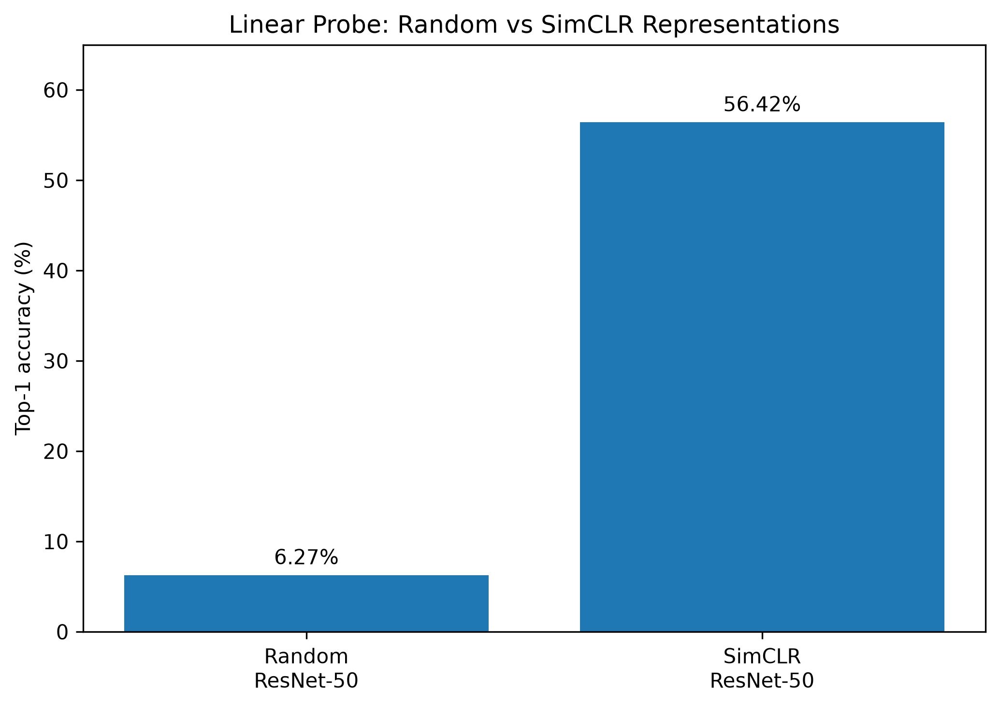
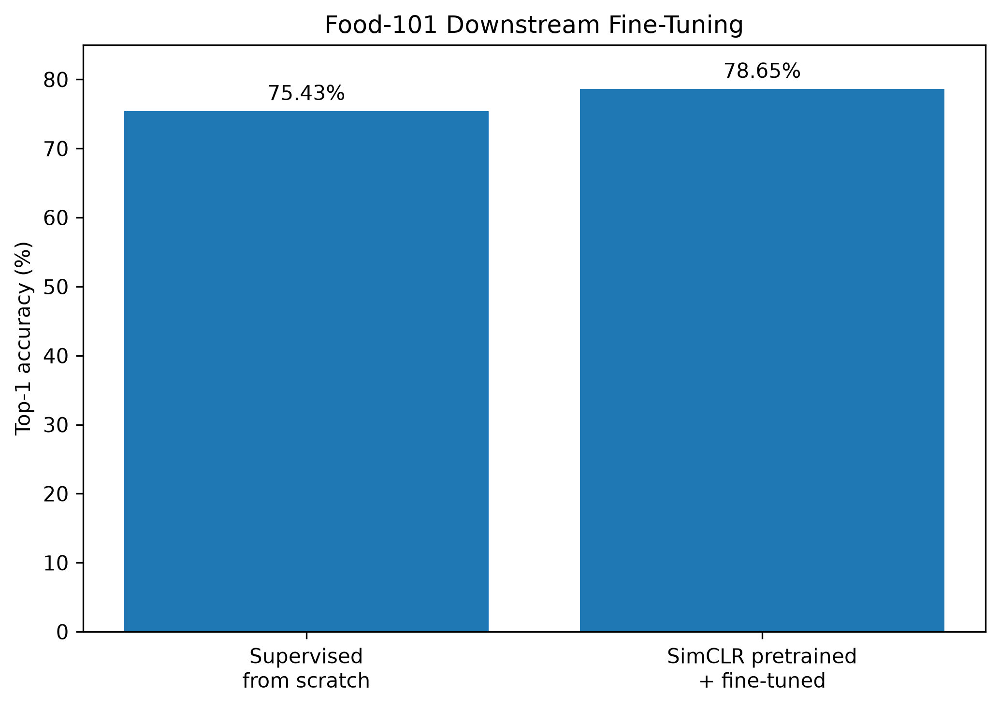
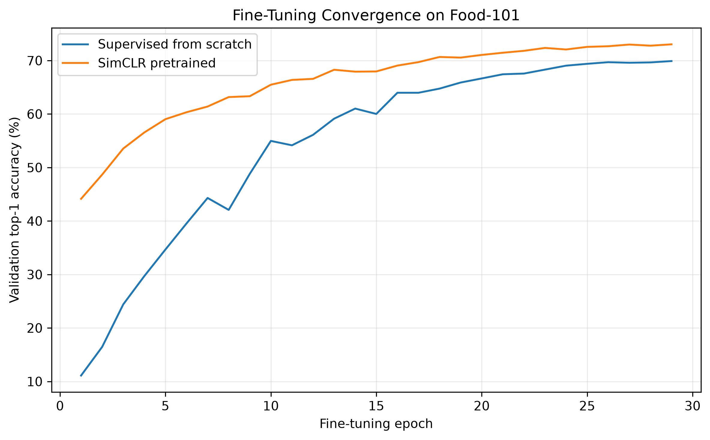
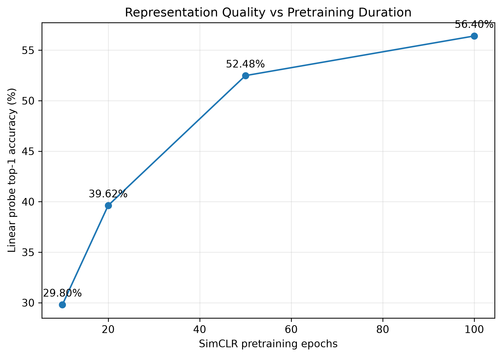
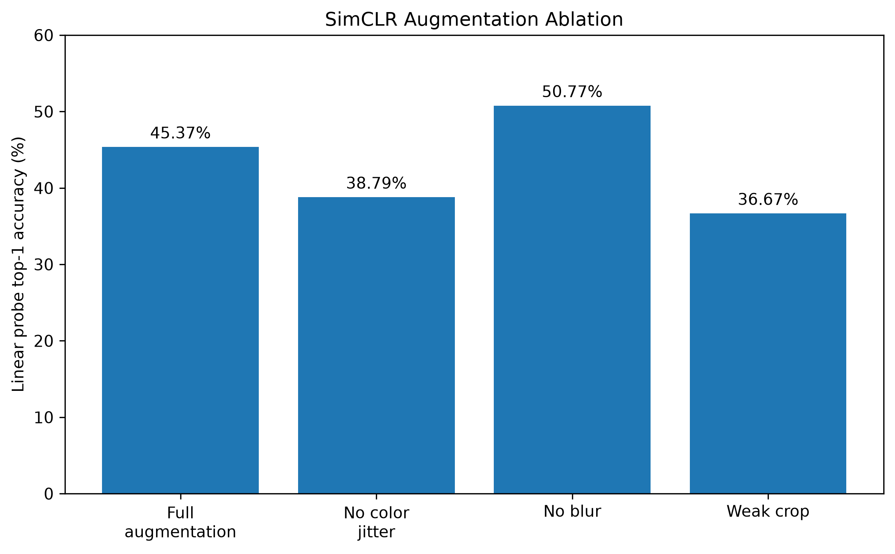
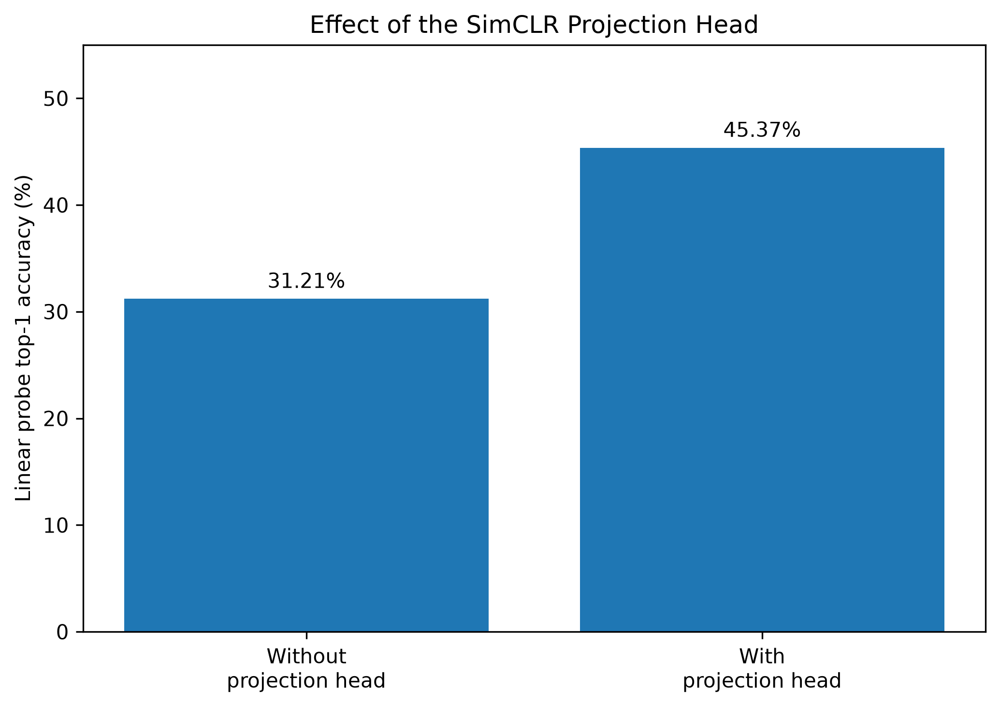

# Self-Supervised Visual Representation Learning with SimCLR

A PyTorch study of **self-supervised visual representation learning with SimCLR**, evaluated on **Food-101** using linear probing, supervised fine-tuning, and controlled ablation experiments.

The project investigates not only whether contrastive pretraining learns useful visual representations, but also **how representation quality evolves during training and which SimCLR design choices matter most**.

---

## Overview

Modern deep learning models usually rely on large labeled datasets. Self-supervised learning instead attempts to learn useful representations directly from unlabeled data.

This project implements the core SimCLR pipeline:

$$
x
\rightarrow
\big(t_1(x),t_2(x)\big)
\rightarrow
f_\theta
\rightarrow
h
\rightarrow
g_\phi
\rightarrow
z
\rightarrow
\mathcal{L}_{\mathrm{NT\text{-}Xent}}
$$

where:

- $t_1,t_2$ are stochastic image augmentations,
- $f_\theta$ is a ResNet-50 encoder,
- $h \in \mathbb{R}^{2048}$ is the learned representation,
- $g_\phi$ is a nonlinear projection head,
- $z \in \mathbb{R}^{128}$ is the contrastive embedding,
- $\mathcal{L}_{\mathrm{NT\text{-}Xent}}$ is the normalized temperature-scaled cross-entropy loss.

The encoder is trained **without using Food-101 class labels** during self-supervised pretraining.

The learned representation is then evaluated through:

1. **Linear probing**
2. **End-to-end supervised fine-tuning**
3. **Pretraining-duration analysis**
4. **Augmentation ablations**
5. **Projection-head ablation**

---

## Dataset

The main experiments use **Food-101**, containing 101 food categories.

| Split | Images |
|---|---:|
| Training | 75,750 |
| Test | 25,250 |
| Total | 101,000 |

During SimCLR pretraining, class labels are ignored.

Each training image generates two independently augmented views:

$$
x \rightarrow x_1,\;x_2
$$

The two views of the same image form a positive pair.

---

## Architecture

### Encoder

The encoder is a **ResNet-50** instantiated from `torchvision` with randomly initialized weights.

The original classification layer is removed:

$$
\mathrm{ResNet\text{-}50}
\rightarrow
h \in \mathbb{R}^{2048}
$$

No ImageNet-pretrained weights are used.

### Projection Head

The SimCLR projection head is a two-layer MLP:

$$
2048
\rightarrow
2048
\rightarrow
\mathrm{ReLU}
\rightarrow
128
$$

The contrastive objective is applied to the projected representation $z$, while the encoder representation $h$ is retained for downstream evaluation.

### Contrastive Loss

For a batch of $N$ original images, two augmentations are generated for every image, producing $2N$ representations.

For each anchor:

- one representation is its positive,
- the remaining $2N-2$ representations act as negatives.

The model is trained with NT-Xent:

```math
\ell_i =
-\log
\frac{
\exp\left(s(z_i,z_j)/\tau\right)
}{
\sum_{k \neq i}
\exp\left(s(z_i,z_k)/\tau\right)
}
```

where $s(z_i,z_j)$ denotes cosine similarity and $\tau$ is the temperature parameter.

The main experiment uses:

```math
\tau = 0.5
```
---

## Main Pretraining Setup

The reference SimCLR model was trained with:

| Parameter | Value |
|---|---:|
| Encoder | ResNet-50 |
| Dataset | Food-101 |
| Input resolution | $224\times224$ |
| Batch size | 128 |
| Epochs | 100 |
| Representation dimension | 2048 |
| Projection dimension | 128 |
| Temperature | 0.5 |
| Optimizer | AdamW |
| Initial learning rate | $3\times10^{-4}$ |
| Weight decay | $10^{-4}$ |
| LR schedule | Cosine annealing |
| Precision | Automatic mixed precision |

With batch size $N=128$, each anchor has:

$$
2N-2=254
$$

in-batch negatives.

Training was performed on an **NVIDIA Tesla T4 GPU**.

---

# Results

## 1. Linear Probe

The first evaluation asks:

> Are the representations learned by SimCLR already useful without modifying the encoder?

The encoder is frozen and only a linear classifier is trained:

$$
h_{2048}
\rightarrow
\mathrm{Linear}(2048,101)
$$

The same protocol is applied to a randomly initialized frozen ResNet-50.

| Frozen encoder | Top-1 accuracy |
|---|---:|
| Random ResNet-50 | **6.27%** |
| SimCLR ResNet-50 | **56.42%** |

The improvement is:

$$
\boxed{+50.15\text{ percentage points}}
$$



This provides direct evidence that self-supervised contrastive pretraining transformed the encoder into a representation space where Food-101 categories are substantially more linearly separable.

Importantly, the downstream classifier is only linear. The performance therefore reflects information already encoded in the learned representation.

---

## 2. Supervised Fine-Tuning

The second experiment asks:

> Does SimCLR also provide a better initialization for fully supervised training?

Two ResNet-50 models are compared:

$$
\text{Random initialization}
\rightarrow
\text{supervised training}
$$

versus

$$
\text{SimCLR initialization}
\rightarrow
\text{supervised fine-tuning}
$$

All encoder parameters are trainable in both cases.

| Initialization | Test Top-1 | Test Top-5 |
|---|---:|---:|
| Supervised from scratch | **75.43%** | **93.13%** |
| SimCLR pretrained + fine-tuned | **78.65%** | **94.57%** |

SimCLR pretraining improves Top-1 accuracy by:

$$
\boxed{+3.21\text{ percentage points}}
$$



The gain is naturally smaller than in linear probing because the supervised baseline is allowed to learn its entire representation from labels.

Nevertheless, the pretrained encoder reaches a better final downstream solution.

### Fine-Tuning Convergence



The learning curves also allow comparison of the optimization dynamics of random initialization and SimCLR initialization.

---

# Ablation Studies

## 3. Representation Quality vs Pretraining Duration

To measure how representation quality evolves during self-supervised training, intermediate SimCLR checkpoints were evaluated using the same linear-probe protocol.

| Pretraining epochs | Linear-probe Top-1 |
|---:|---:|
| 10 | **29.80%** |
| 20 | **39.62%** |
| 50 | **52.48%** |
| 100 | **56.40%** |



Representation quality improves consistently with longer pretraining.

The gains are:

$$
10\rightarrow20:
\quad +9.82\text{ pp}
$$

$$
20\rightarrow50:
\quad +12.86\text{ pp}
$$

$$
50\rightarrow100:
\quad +3.92\text{ pp}
$$

The results show clear diminishing returns in the later stages of training, although additional pretraining continues to improve downstream representation quality.

---

## 4. Augmentation Ablation

SimCLR relies heavily on how positive pairs are constructed.

The reference augmentation pipeline includes:

- random resized cropping,
- horizontal flipping,
- color jitter,
- grayscale conversion,
- Gaussian blur.

Three controlled modifications were evaluated after **30 epochs of SimCLR pretraining**.

| Augmentation setup | Linear-probe Top-1 | Difference vs baseline |
|---|---:|---:|
| Weak crop | **36.67%** | -8.70 pp |
| No color jitter | **38.79%** | -6.58 pp |
| Full augmentation | **45.37%** | — |
| No Gaussian blur | **50.77%** | +5.40 pp |



### Strong Cropping Matters

Weakening the random crop produces the largest degradation relative to the baseline:

$$
45.37\%
\rightarrow
36.67\%
$$

Strong spatial transformations therefore appear important for forcing the model to learn semantic invariance instead of relying mainly on local visual correspondence.

### Color Jitter Matters

Removing color jitter reduces performance by:

$$
6.58\text{ pp}
$$

Color perturbations make it harder for the model to solve the contrastive task through simple color statistics and encourage greater invariance to appearance changes.

### Gaussian Blur Behaves Differently on Food-101

Removing Gaussian blur improves performance:

$$
45.37\%
\rightarrow
50.77\%
$$

In the reference implementation used in this project, Gaussian blur is applied to every augmented view.

Food categories can depend strongly on fine texture, surface structure, toppings, and preparation details. Systematic blurring may therefore remove visual information that is useful for learning Food-101 representations.

This result should **not** be interpreted as a general claim that Gaussian blur is harmful to SimCLR. It is specific to the dataset and augmentation configuration studied here.

---

## 5. Projection-Head Ablation

SimCLR does not optimize the contrastive objective directly on the encoder representation $h$.

Instead:

$$
h
\rightarrow
g_\phi(h)
\rightarrow
z
\rightarrow
\mathcal{L}_{\mathrm{NT\text{-}Xent}}
$$

To test the importance of this design choice, a second model was trained without the projection head:

$$
h
\rightarrow
\mathcal{L}_{\mathrm{NT\text{-}Xent}}
$$

Both models were evaluated after **30 epochs** using the same linear-probe protocol.

| Architecture | Linear-probe Top-1 |
|---|---:|
| Without projection head | **31.21%** |
| With projection head | **45.37%** |

The projection head provides:

$$
\boxed{+14.16\text{ percentage points}}
$$



The result supports the idea that the projection head creates a useful separation between:

$$
h:
\quad
\text{representation retained for downstream tasks}
$$

and

$$
z:
\quad
\text{representation specialized for contrastive optimization}
$$

Optimizing NT-Xent directly on $h$ produces substantially weaker downstream representations in this experiment.

---

# Main Findings

The experiments lead to four main conclusions.

### 1. SimCLR learns useful representations without class labels

Linear-probe accuracy increases from:

$$
6.27\%
\rightarrow
56.42\%
$$

when replacing random frozen ResNet-50 features with SimCLR-pretrained features.

### 2. Self-supervised pretraining improves downstream supervised learning

Fine-tuning improves from:

$$
75.43\%
\rightarrow
78.65\%
$$

Top-1 accuracy compared with supervised training from scratch.

### 3. Representation quality strongly depends on augmentation design

Strong random cropping and color jitter substantially improve representation quality.

In this specific Food-101 setup, removing the always-applied Gaussian blur improves the 30-epoch linear-probe result.

### 4. The nonlinear projection head is a critical design component

Removing it reduces linear-probe accuracy from:

$$
45.37\%
\rightarrow
31.21\%
$$

at the same 30-epoch pretraining budget.

Overall, the project shows that contrastive pretraining progressively constructs a feature space that transfers effectively to semantic image classification.

---

# Repository Structure

```text
self-supervised-visual-representation-learning/
│
├── src/
│   ├── data/
│   │   ├── augmentations.py
│   │   └── datasets.py
│   │
│   ├── models/
│   │   ├── encoder.py
│   │   ├── projection_head.py
│   │   └── simclr.py
│   │
│   ├── losses/
│   │   └── nt_xent.py
│   │
│   └── evaluate/
│       └── linear_probe_utils.py
│
├── scripts/
│   ├── train_stl10.py
│   ├── train_food101.py
│   ├── linear_probe_food101.py
│   ├── fine_tune_food101.py
│   ├── experiment_training_duration.py
│   ├── ablation_augmentations_food101.py
│   ├── ablation_projection_head_food101.py
│   ├── generate_figures.py
│   └── bootstrap_onyxia.sh
│
├── results/
│   ├── linear_probe_food101.json
│   ├── food101_finetuning_comparison.json
│   ├── supervised_scratch_history.csv
│   ├── simclr_finetuned_history.csv
│   ├── training_duration_study.json
│   ├── augmentation_ablation.json
│   └── projection_head_ablation.json
│
├── figures/
│   ├── linear_probe_comparison.png
│   ├── finetuning_comparison.png
│   ├── finetuning_learning_curves.png
│   ├── pretraining_duration.png
│   ├── augmentation_ablation.png
│   └── projection_head_ablation.png
│
├── requirements.txt
├── .gitignore
└── README.md
```

Large datasets and model checkpoints are intentionally excluded from Git.

---

# Running the Project

## Installation

```bash
git clone https://github.com/moadprog/self-supervised-visual-representation-learning.git

cd self-supervised-visual-representation-learning

python -m pip install -r requirements.txt
```

A CUDA-enabled GPU is strongly recommended for SimCLR pretraining.

---

## Pretraining

Train the main Food-101 SimCLR model:

```bash
python -m scripts.train_food101
```

The training pipeline includes:

- automatic mixed precision,
- cosine learning-rate scheduling,
- checkpointing,
- training-state recovery,
- TensorBoard logging.

---

## Linear Probe

Evaluate frozen representations:

```bash
python -m scripts.linear_probe_food101
```

This compares:

```text
Random frozen ResNet-50
vs
SimCLR frozen ResNet-50
```

---

## Fine-Tuning

Run the supervised comparison:

```bash
python -m scripts.fine_tune_food101
```

This compares:

```text
Supervised ResNet-50 from scratch
vs
SimCLR-pretrained ResNet-50 fine-tuning
```

---

## Ablation Experiments

Representation quality versus pretraining duration:

```bash
python -m scripts.experiment_training_duration
```

Augmentation ablation:

```bash
python -m scripts.ablation_augmentations_food101
```

Projection-head ablation:

```bash
python -m scripts.ablation_projection_head_food101
```

---

## Regenerate Figures

All figures are generated directly from the stored experiment results:

```bash
python -m scripts.generate_figures
```

This keeps the visualizations reproducible from the numerical outputs stored in the repository.

---

# Engineering Notes

The project was developed with **PyTorch** in a GPU environment.

Heavy artifacts such as:

```text
datasets/
checkpoints/
embeddings/
```

are excluded from Git through `.gitignore`.

During experimentation:

- source code was version-controlled with Git,
- datasets and checkpoints were stored in object storage,
- temporary local training data was staged on the compute instance,
- checkpoints contained model, optimizer, scheduler, and mixed-precision scaler states,
- long-running experiments could therefore resume after interruption.

---

# Limitations

The experiments were designed to study SimCLR under a realistic but compute-constrained setting rather than reproduce the original large-scale ImageNet training regime.

In particular:

- Food-101 is used instead of ImageNet,
- the largest batch size is 128,
- the main model is pretrained for 100 epochs,
- ablation experiments use 30-epoch training budgets,
- hyperparameter sweeps are intentionally limited.

The results should therefore be interpreted within this experimental setup rather than as a direct reproduction of the original SimCLR benchmark.

---

# Reference

This project is based on:

**Ting Chen, Simon Kornblith, Mohammad Norouzi, Geoffrey Hinton.**  
*A Simple Framework for Contrastive Learning of Visual Representations.*  
ICML 2020.

---

# Summary

The central result of the project is that a ResNet-50 trained **without Food-101 class labels** using contrastive learning develops representations that are already highly useful for semantic classification:

$$
\boxed{
6.27\%
\rightarrow
56.42\%
}
$$

under frozen linear evaluation.

Those representations also improve fully supervised downstream performance:

$$
\boxed{
75.43\%
\rightarrow
78.65\%
}
$$

The ablation experiments further show that **augmentation design and the nonlinear projection head are major determinants of representation quality**.